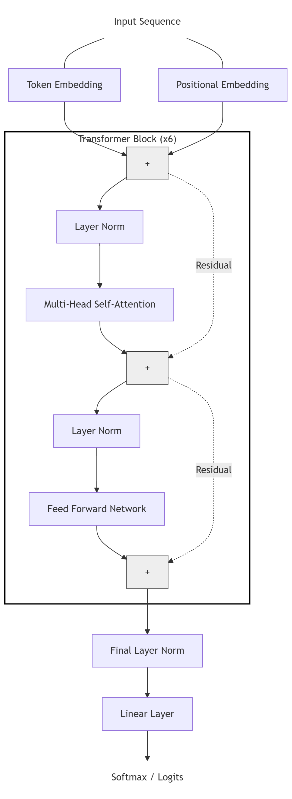

# PudhumaiKaviGPT: A Tamil Character-level Transformer

Implementation of a character-level GPT trained on the works of Mahakavi Bharathiyar.

## About the project:

This is a ground-up implementation of a Generative Pretrained Transformer built following the architectural principles outlined in Andrej Karpathy's "Let's build GPT" tutorial. The model is specifically adapted for the Tamil language, utilizing the poetic corpus of Subramania Bharati (Bharathiyar).

**Reference Video:** [Let's build GPT: from scratch, in code, spelled out.](https://www.youtube.com/watch?v=kCc8FmEb1nY)

## Technical Highlights:

* **Architecture:** Decoder-only Transformer.

  

* **Scaling:** Multi-layer stack with $6$ heads and an embedding dimension of $384$.
* **Data Strategy:** Two-stage training process involving pre-training on a Tamil Wikipedia dataset followed by fine-tuning on the Bharathiyar corpus to compensate for dataset size limitations.
* **Optimization:** Implementation of a lower learning rate ($10^{-4}$) and increased dropout ($0.3$) during fine-tuning to ensure stable weight transfer from the pre-trained state.

## Training Results:

The model underwent pre-training on the Tamil Wikipedia dataset and was subsequently fine-tuned for $2000$ iterations on the Bharathiyar corpus.

* **Training Observation:** Faster loss convergence was noted in the Tamil dataset compared to TinyShakespeare, likely due to the granular nature of Tamil compound characters (*kootu eluthukal*).
* **Evaluation Interval:** $50$ iterations for close monitoring of validation metrics.

## Sample Output:

The following is an example of the poetic generation produced by the model after fine-tuning:

## Data & Inspiration:

The training data consists of the public domain works of Subramania Bharati, a renowned Tamil poet and freedom fighter known for his themes of patriotism and social reform.

**Sample Reference Poem:**

> *தேடிச் சோறுநிதம் தின்று - பல சின்னஞ்சிறுகதைகள்பேசி...*
> *வேடிக்கை மனிதரைப் போலே - நான் வீழ்வேனென்று நினைத்தாயோ?*

**English Translation:**

> "Scavenging for their daily rice, and wagging chins on various insignificant fibs... Like these risible people, did you think I would fall suit and be struck down?"

## Data sources:

### Wiki dataset:
https://www.kaggle.com/datasets/aswin037/tamil-wiki-summarization?select=Tamil+wiki-data.csv

### Bharathiyar Poems:
1. https://www.projectmadurai.org/pm_etexts/utf8/pmuni0012_01.html
2. https://www.projectmadurai.org/pm_etexts/utf8/pmuni0012_02.html
3. https://www.projectmadurai.org/pm_etexts/utf8/pmuni0021.html
4. https://www.projectmadurai.org/pm_etexts/utf8/pmuni0049.html
